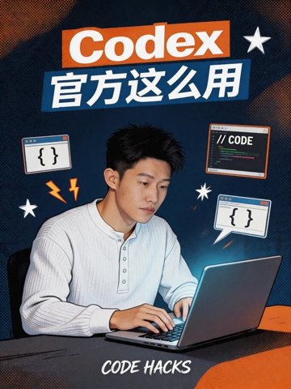
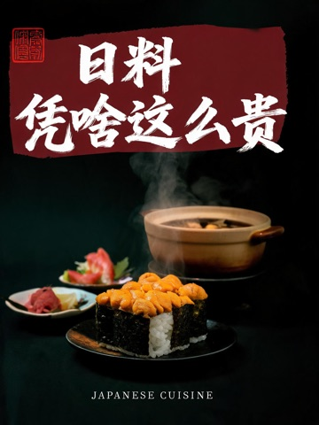
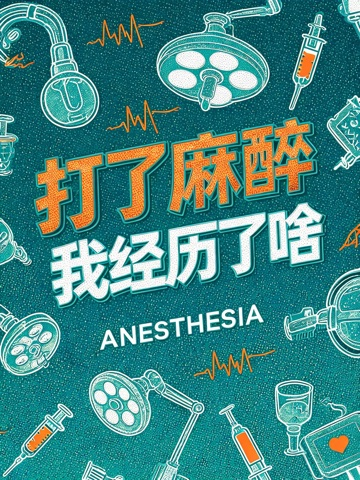
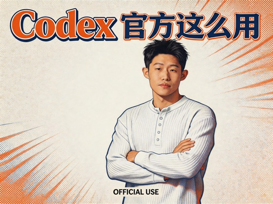
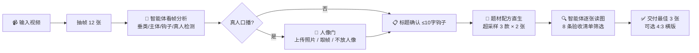

<p align="center">
  
</p>

<h1 align="center">🎬 Josh Video Cover Skill</h1>

<p align="center"><b>丢一条视频进来，AI 智能体还你 3 张海报级封面。</b></p>

<p align="center">
  
  
  
  
</p>

> 本页所有配图（包括顶部横幅）均由本 skill 自己生成 —— 这就是 demo。

---

## ✨ 作品墙

每张都来自真实视频的端到端产出，经人工逐张验收。

| 真人口播 · AI 工具实测 | 真人口播 · Codex 解读 | 复古印刷 · 真人套印 | 取帧成人像 · 相机测评 |
|:---:|:---:|:---:|:---:|
|  |  |  |  |

| 美食纪录片 · 毛笔字 | 美食纪录片 · 纯黑高级 | 设计教程 · 以身作则 | 医学科普 · 缝线字 |
|:---:|:---:|:---:|:---:|
|  |  |  |  |

**4:3 横版**同一视觉系统直生（非竖版裁切/改造）：

| | |
|:---:|:---:|
|  |  |

---

## 🧠 工作原理



**核心理念：配方直生，而非垫图模仿。** 案例库只用来校准"该走哪套配方"，每张图都是按题材配方+排版铁律全新生成 —— 实测比垫参考图（易泄漏、易串味）质量高一个档位。

## 🎯 七套题材配方

| 视频类型 | 配方 | 风格 |
|---|---|---|
| 真人口播（AI工具/测评） | 风格化重绘 | 极繁丝网印刷，人物按海报风重绘+点题动作 |
| 产品测评（芯片/数码） | 产品影棚 | 发布会主视觉，金属玻璃质感 |
| 实物操作（拆机/维修） | 手+工具+实物 | 微距工作台，专业拆解感 |
| 美食纪录片 | 电影感食物微距 | 暗底+毛笔大字+红印 |
| 医学科普 | 医疗符号海报 | 冷青绿手术室+扁平插画 |
| 设计/排版教程 | 设计感海报 | 撞色描边大字，封面即示范 |
| 光影氛围（相机/出片） | 暖调胶片 | 颗粒光晕，生活美学 |

外加贯穿全部的硬规则：**标题占画面 75-90% 不顶边**、**字体设计多样化**（艺术字/书法/描边，拒绝色块平铺）、**配色跟品牌走**（OpenAI→科技青蓝，Claude→珊瑚橙）、**≤10 字主文案**、**绝不编造真人脸**。

## 🚀 安装

### Claude Code（开箱即用）

```bash
git clone https://github.com/ciaozz2504764976-glitch/Josh-video-cover-skill.git \
  ~/.claude/skills/video-cover-generator-eval-20260525
```

新会话给视频路径并说「做封面」即自动触发。

### Codex / 其他智能体

把本仓库放进项目目录，智能体经 `AGENTS.md` 找到并遵循 `SKILL.md`（需支持多模态读图）。

### 依赖（自行配置）

```bash
# 生图引擎：即梦 CLI（需自己的即梦账号与积分）
curl -s https://jimeng.jianying.com/cli | bash
dreamina user_credit   # 触发登录

brew install ffmpeg    # 抽帧
```

> 引擎可替换：编排逻辑在 `scripts/cover_pipeline.py`，把 dreamina 调用换成任意文生图 API 即可。

## ⚠️ 已知限制（v1.1）

- 标题偶发偏小/生僻字写错 → 超采样筛选兜底，极端时重出一轮
- 取视频帧做人像 = 风格化重绘，神似非精确；要精确请上传清晰正脸照
- 实物操作类（手部特写）整体弱于其他题材
- 生图消耗即梦积分（约 6-12 张/条视频，2k）

## 🤝 反馈

开 Issue：附上不满意的封面 + 一句"哪里不行"。每条反馈都会被沉淀成配方规则 —— 这个 skill 就是这么长大的。

---

<p align="center"><sub>v1.1 · 2026-06 · 由 8 条真实视频逐条人工验收打磨 · Made by Josh × Claude</sub></p>
