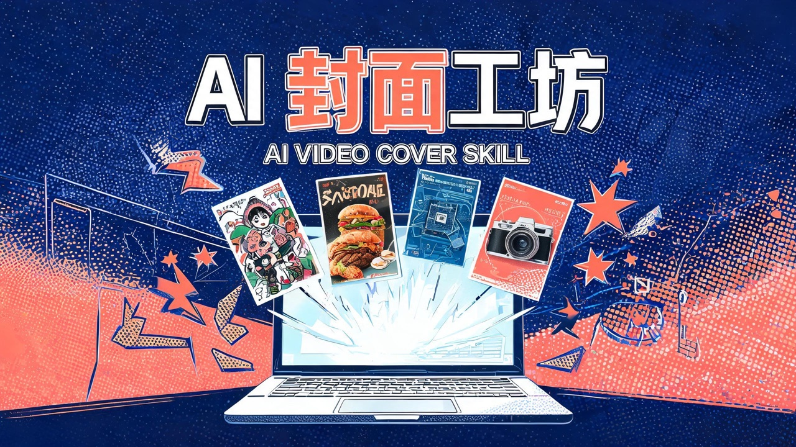
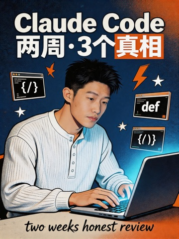
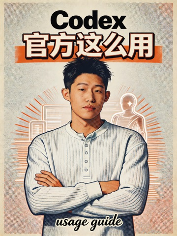
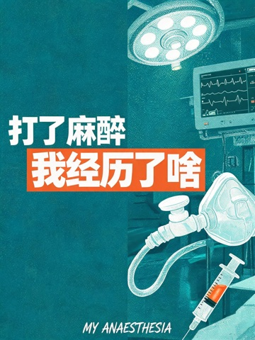
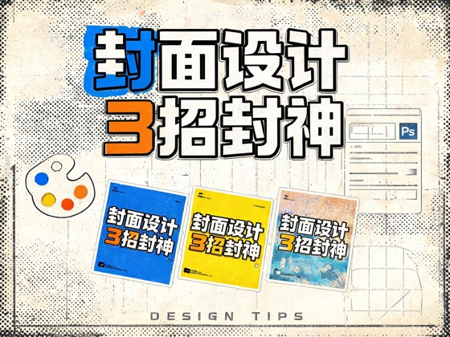
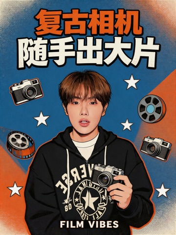
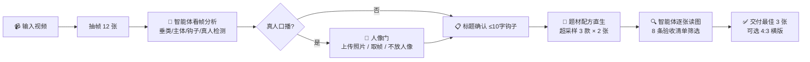

<p align="center">
  
</p>

<h1 align="center">🎬 Josh Video Cover Skill</h1>

<p align="center"><b>真正的端到端：上传一条视频，得到有点击欲、画面美感在线的封面。</b><br>
<sub>看片 · 定题 · 选风格 · 出图 · 质检 —— 中间全部由 AI 智能体完成，你只做两个决定：要不要露脸、用哪个标题。</sub></p>

<p align="center">
  
  
  
  
</p>

> 本页所有配图（包括顶部横幅）均由本 skill 自己生成 —— 这就是 demo。

---

## ✨ 作品墙

以下每张都是「丢进一条真实视频 → 端到端自动产出」并经人工验收的优质案例。

| AI 工具实测 · Claude 橙 | Codex · OpenAI 青 | Codex · 复古套印 | 相机测评 · 取帧成人像 |
|:---:|:---:|:---:|:---:|
|  |  |  |  |

| 相机测评 · 暖调跃起 | 美食纪录片 · 毛笔字 | 设计教程 · 封面即示范 | 医学科普 · 手术室插画 |
|:---:|:---:|:---:|:---:|
|  |  |  |  |

> 留意前三张：同一位创作者，讲 Claude 的封面是珊瑚橙、讲 Codex 的封面是 OpenAI 青 —— **配色跟品牌走**是写进配方的规则，不是巧合。

### 同一案例 · 双比例直出

竖版 3:4 与横版 4:3 都按同一配方直接生成 —— 同一视觉系统，不是裁切改造。

| | 3:4 竖版 | 4:3 横版 |
|:---:|:---:|:---:|
| **设计教程** |  |  |
| **相机测评** |  |  |

---

## 🧠 工作原理



**核心理念：配方直生，而非垫图模仿。** 案例库只用来校准"该走哪套配方"，每张图都按题材配方+排版铁律全新生成 —— 实测比垫参考图（易泄漏、易串味）质量高一个档位。

## 🎯 七套题材配方

| 视频类型 | 配方 | 风格 |
|---|---|---|
| 真人口播（AI工具/测评） | 风格化重绘 | 极繁丝网印刷，人物按海报风重绘+点题动作 |
| 产品测评（芯片/数码） | 产品影棚 | 发布会主视觉，金属玻璃质感 |
| 实物操作（拆机/维修） | 手+工具+实物 | 微距工作台，专业拆解感 |
| 美食纪录片 | 电影感食物微距 | 暗底+毛笔大字+红印 |
| 医学科普 | 医疗符号海报 | 冷青绿手术室+扁平插画 |
| 设计/排版教程 | 设计感海报 | 撞色描边大字，封面即示范 |
| 光影氛围（相机/出片） | 暖调胶片 | 颗粒光晕，生活美学 |

外加贯穿全部的硬规则：**标题占画面 75-90% 不顶边**、**字体设计多样化**（艺术字/书法/描边，拒绝色块平铺）、**配色跟品牌走**（OpenAI→科技青蓝，Claude→珊瑚橙）、**≤10 字主文案**、**绝不编造真人脸**。

## 🚀 安装

### Claude Code（开箱即用）

```bash
git clone https://github.com/joshzhao-ai/Josh-video-cover-skill.git \
  ~/.claude/skills/video-cover-generator-eval-20260525
```

新会话给视频路径并说「做封面」即自动触发。

### Codex / 其他智能体

把本仓库放进项目目录，智能体经 `AGENTS.md` 找到并遵循 `SKILL.md`（需支持多模态读图）。

### 依赖（自行配置）

```bash
# 生图引擎：即梦 CLI（需自己的即梦账号与积分）
curl -s https://jimeng.jianying.com/cli | bash
dreamina user_credit   # 触发登录

brew install ffmpeg    # 抽帧
```

> 引擎可替换：编排逻辑在 `scripts/cover_pipeline.py`，把 dreamina 调用换成任意文生图 API 即可。

## ⚠️ 已知限制（v1.1）

- 标题偶发偏小/生僻字写错 → 超采样筛选兜底，极端时重出一轮
- 取视频帧做人像 = 风格化重绘，神似非精确；要精确请上传清晰正脸照
- 实物操作类（手部特写）整体弱于其他题材
- 生图消耗即梦积分（约 6-12 张/条视频，2k）

## 🤝 反馈

开 Issue：附上不满意的封面 + 一句"哪里不行"。每条反馈都会被沉淀成配方规则 —— 这个 skill 就是这么长大的。

---

<p align="center"><sub>v1.1 · 2026-06 · 由 8 条真实视频逐条人工验收打磨 · Made by Josh × Claude</sub></p>
