<h1 align="center">Josh Video Cover Skill</h1>

<p align="center"><b>让视频的亮点，在第一眼被看见。</b></p>
<p align="center">把爆款视频背后的封面经验，装进你的 AI Agent。</p>

<p align="center">
  
  
  
  
</p>

<p align="center">
  <a href="#作品先说话">真实作品与成绩</a> ·
  <a href="#快速开始">快速开始</a> ·
  <a href="#同一条视频不同的生成方式">看效果对照</a> ·
  <a href="#像和设计师一起做封面">使用流程</a>
</p>

## 作品先说话

**99.1 万播放的视频，用的是这套 Skill 做的封面。**

下面四张都是使用本 Skill 制作、实际发布的封面。作品与成绩，一一对应。

<table>
  <tr>
    <td width="25%"><a href="assets/published/codex-official-3x4.png"></a></td>
    <td width="25%"><a href="assets/published/kimi-k3-3x4.png">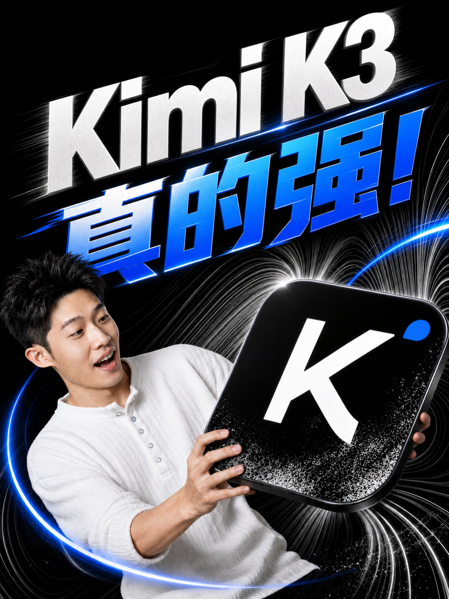</a></td>
    <td width="25%"><a href="assets/published/claude-wrap-3x4.png">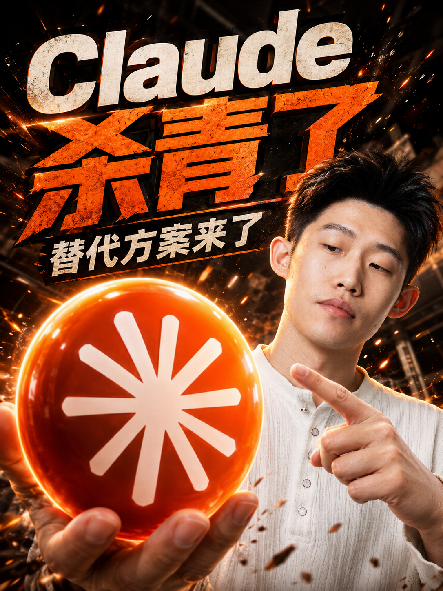</a></td>
    <td width="25%"><a href="assets/published/claude-vs-codex-3x4.png">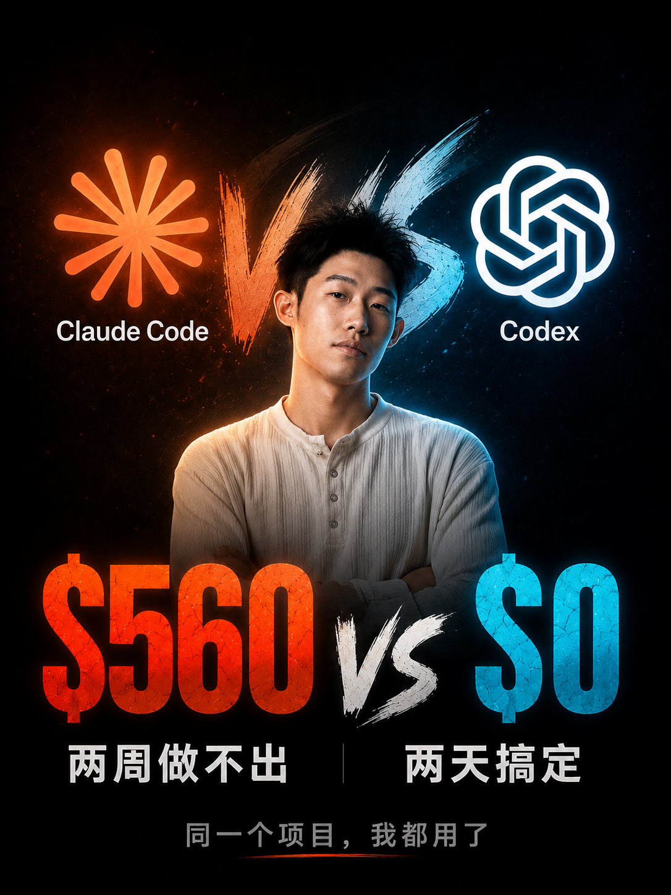</a></td>
  </tr>
  <tr>
    <td align="center"><b>Codex 官方分享</b><br>99.1 万播放<br><sub>封面点击率</sub><br><b>12.43%</b></td>
    <td align="center"><b>Kimi K3</b><br>1.2 万播放<br><sub>封面点击率</sub><br><b>49.78%</b></td>
    <td align="center"><b>Claude 杀青了</b><br>1.4 万播放<br><sub>封面点击率</sub><br><b>32.8%</b></td>
    <td align="center"><b>Claude vs Codex</b><br>42.8 万播放<br><sub>封面点击率</sub><br><b>12.94%</b></td>
  </tr>
</table>

### 真实后台，直接看数据

**Codex 官方分享 · 99.1 万播放 / 4.9 万收藏 / 5381 涨粉**

[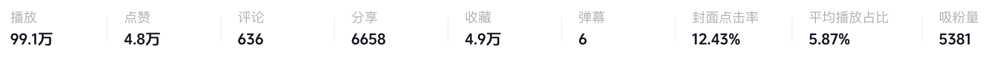](assets/evidence/douyin-codex.png)

**Kimi K3 · 49.78% 封面点击率**

[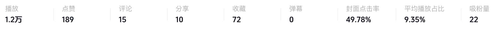](assets/evidence/douyin-kimi-and-versus.png)

<details>
<summary>展开另外两张封面的后台数据</summary>

**Claude 杀青了 · 32.8% 封面点击率**

[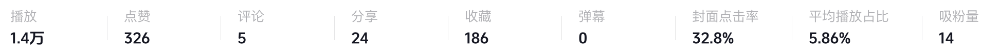](assets/evidence/douyin-claude.png)

**Claude Code vs Codex · 42.8 万播放**

[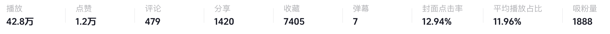](assets/evidence/douyin-kimi-and-versus.png)

</details>

<sub>横条从抖音后台截图原样裁切，点击可看完整截图。以上为精选案例的截图时点成绩；播放表现由内容、选题、封面与分发共同影响。[查看来源与统计口径](docs/RESULTS.md)。</sub>

## 从内容到封面，把经验变成工作流

我是 Josh。这套 Skill 来自我持续制作、发布视频的封面实践，现在把它交给你的 Agent：

- **质量：** 按题材设计字体、人物、产品与光影，同时检查大图质感和小图辨识度。
- **效率：** 视频分析、标题策划、三条创意路线、横版延展，一次对话串起来。
- **点击吸引力：** 把视频里的问题、收益或结果，变成一眼读懂的标题与主视觉。
- **系列一致性：** 横竖版沿用选中方向的文案、人像、配色和字体。

## 快速开始

**① 安装：** 把这句话发给 Codex、Claude Code 等 AI Agent。

```text
帮我安装这个视频封面 Skill，并检查运行依赖：
https://github.com/joshzhao-ai/Josh-video-cover-skill/tree/agent/showcase-v2
```

**② 使用：** 安装完成后，新开对话，附上视频，说「**给这个视频制作封面**」。

[安装指南与平台支持](docs/INSTALL.md) · [常见问题](#常见问题)

## 同一条视频，不同的生成方式

**5 类题材，15 张封面，一起看。** 每列是同一视频主题，每行是一种生成方式。点击单图放大。

<table>
  <tr><th width="10%">生成方式</th><th width="18%">摄影</th><th width="18%">教育</th><th width="18%">科技</th><th width="18%">游戏</th><th width="18%">美食</th></tr>
  <tr><td align="center">Seedream<br><sub>5.0 Lite</sub><br>直出</td><td><a href="assets/comparison/camera-direct.png"></a></td><td><a href="assets/comparison/education-direct.png">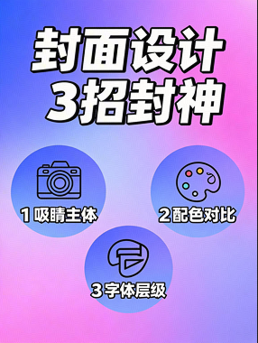</a></td><td><a href="assets/comparison/codex-direct.jpg">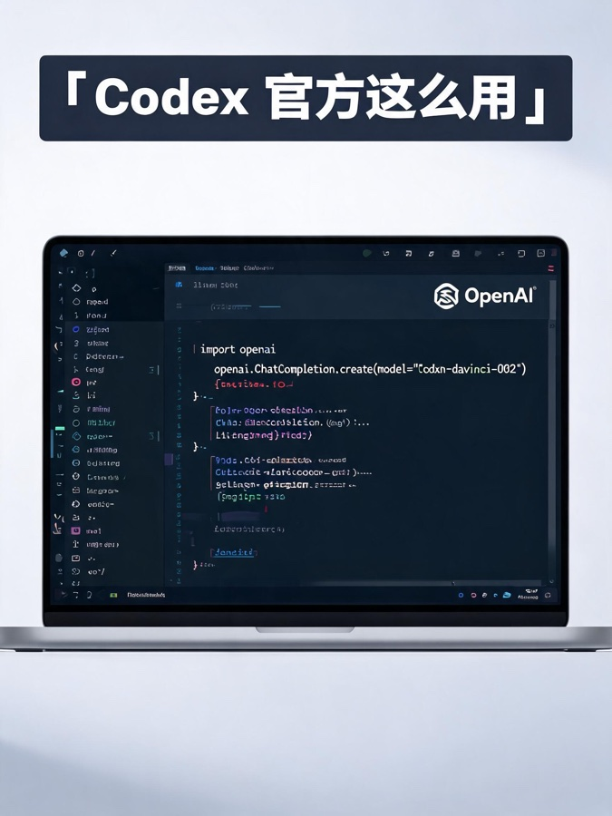</a></td><td><a href="assets/comparison/game-direct.png">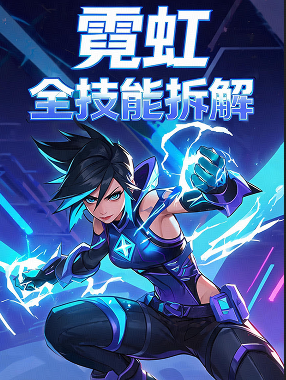</a></td><td><a href="assets/comparison/food-direct.jpg"></a></td></tr>
  <tr><td align="center">Seedream<br><sub>5.0 Lite</sub><br><b>+ Skill</b></td><td><a href="assets/comparison/camera-seedream-skill.png">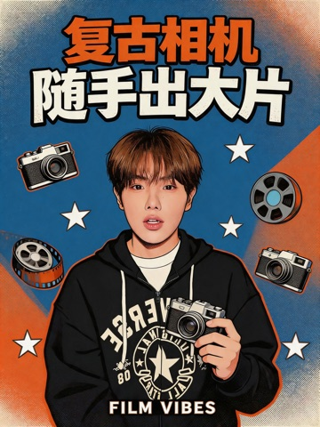</a></td><td><a href="assets/comparison/education-seedream-skill.png">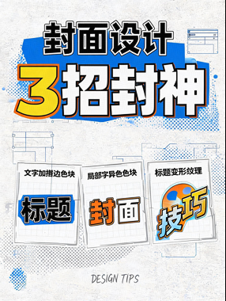</a></td><td><a href="assets/comparison/codex-seedream-skill.jpg">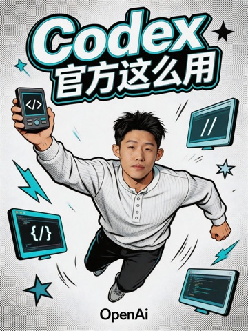</a></td><td><a href="assets/comparison/game-seedream-skill.png">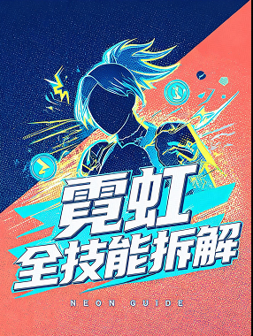</a></td><td><a href="assets/comparison/food-seedream-skill.png"></a></td></tr>
  <tr><td align="center">GPT<br>Image 2<br><b>+ Skill</b></td><td><a href="assets/comparison/camera-gpt-skill.png"></a></td><td><a href="assets/comparison/education-gpt-skill.png">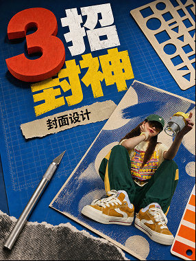</a></td><td><a href="assets/published/codex-official-3x4.png"></a></td><td><a href="assets/comparison/game-gpt-skill.png">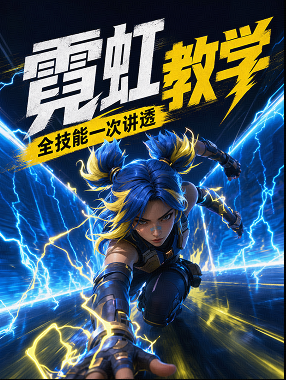</a></td><td><a href="assets/comparison/food-gpt-skill.png">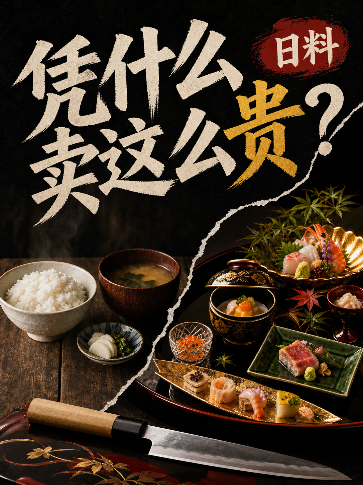</a></td></tr>
</table>

<sub>来自作者的同视频创作对照，模型名沿用原始标注；文案、素材与构图存在差异。用于观察设计表达，不作为严格控制变量的模型排名。</sub>

[看完整 40 张横竖版对照](assets/comparison/original-five-categories.png) · [素材来源与对照说明](docs/COMPARISON.md)

## 让不同内容，有自己的样子

品牌互动、知识讲解、摄影、美食、游戏，都可以找到适合内容的表达。下面是 8 种实际创作方向。

<table>
  <tr><td width="25%" align="center"><b>品牌互动</b><br><sub>人物 × 产品</sub><br><a href="assets/published/kimi-k3-3x4.png"></a></td><td width="25%" align="center"><b>戏剧张力</b><br><sub>橙黑 × 大字</sub><br><a href="assets/published/claude-wrap-3x4.png"></a></td><td width="25%" align="center"><b>知识故事</b><br><sub>黑金 × 方法证据</sub><br><a href="assets/showcase/skill-image2-3x4.jpg"></a></td><td width="25%" align="center"><b>摄影测评</b><br><sub>复古 × 器材样片</sub><br><a href="assets/comparison/camera-gpt-skill.png"></a></td></tr>
  <tr><td width="25%" align="center"><b>设计教程</b><br><sub>拼贴 × 字体层次</sub><br><a href="assets/comparison/education-gpt-skill.png"></a></td><td width="25%" align="center"><b>游戏攻略</b><br><sub>角色 × 动态光效</sub><br><a href="assets/comparison/game-gpt-skill.png"></a></td><td width="25%" align="center"><b>美食叙事</b><br><sub>食物 × 电影布光</sub><br><a href="assets/comparison/food-gpt-skill.png"></a></td><td width="25%" align="center"><b>工具成果</b><br><sub>动作 × 结果展示</sub><br><a href="assets/showcase/ai-ppt-dreamina-3x4.jpg"></a></td></tr>
</table>

[查看双模型作品集](docs/GALLERY.md)

## 同一个创意，横竖都成立

选定竖版后，延续它的文案、人像、配色和字体，重新设计横版的构图与空间。

<table>
  <tr><th colspan="2">Codex 官方分享</th><th colspan="2">Claude 杀青了</th></tr>
  <tr>
    <td width="18%"><a href="assets/published/codex-official-3x4.png"></a></td>
    <td width="32%"><a href="assets/published/codex-official-4x3.png"></a></td>
    <td width="18%"><a href="assets/published/claude-wrap-3x4.png"></a></td>
    <td width="32%"><a href="assets/published/claude-wrap-4x3.png">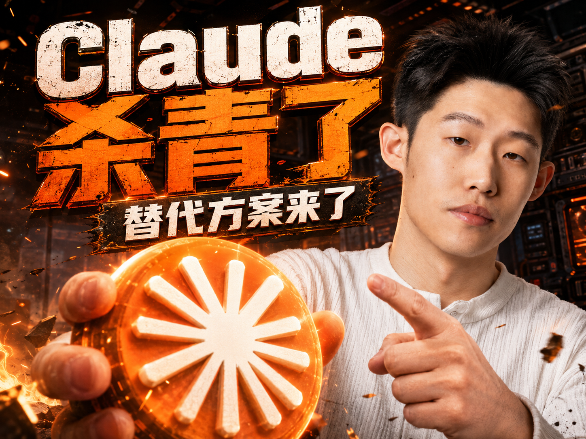</a></td>
  </tr>
  <tr><td align="center">3:4 竖版</td><td align="center">4:3 横版</td><td align="center">3:4 竖版</td><td align="center">4:3 横版</td></tr>
</table>

## 像和设计师一起做封面

**你做关键选择，Agent 负责分析、设计、检查与交付。**

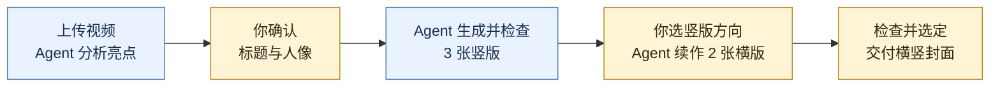
```mermaid
flowchart LR
    A[上传视频<br/>Agent 分析亮点] --> B[你确认<br/>标题与人像]
    B --> C[Agent 生成并检查<br/>3 张竖版]
    C --> D[你选竖版方向<br/>Agent 续作 2 张横版]
    D --> E[检查并选定<br/>交付横竖封面]
    classDef user fill:#fff4d6,stroke:#b8871b,color:#302716
    classDef agent fill:#eaf2ff,stroke:#4c77b8,color:#172e50
    class B,D,E user
    class A,C agent
```

遇到错字、人物偏差或构图问题，只重做对应候选。全过程保留你的标题、人像与方向选择。

<details>
<summary>看一段实际使用方式</summary>

```text
你：给这个视频制作封面。[附视频]
AI：分析视频，给出标题和人像选项。
你：1B。[上传人像，选标题 B]
AI：生成并检查 3 张不同方向的竖版。
你：选第 3 张。
AI：生成并检查 2 张延续该方向的横版。
你：选第 1 张横版。
AI：交付选定的横竖封面。
```

</details>

## 常见问题

**必须上传自己的照片吗？**

有真人的视频会让你选择上传照片、使用清晰视频帧，或不放人像。清晰人像更有利于身份一致性；取帧重绘仍可能产生偏差，需要检查成片。

**需要会设计或写提示词吗？**

按对话选择标题、人像和喜欢的方向即可。你也可以补充风格偏好、必须出现的产品或希望强调的内容。

**生成后可以直接发布吗？**

工作流以可发布封面为目标，并包含逐张检查与重做。生成模型仍可能出现错字、手部异常或人物偏差，最终发布前请确认文字、身份和素材使用权限。

**能做批量测试和模型对比吗？**

仓库提供评测材料。比较时固定原视频、标题、人像、比例与路线，每次只改变一个变量，具体见 [评测协议](EVALUATION.md)。

<details>
<summary><b>开发者导航</b></summary>

| 文件 | 用途 |
| --- | --- |
| [SKILL.md](SKILL.md) | Agent 执行流程、确认节点与交付要求 |
| [标题策略](references/cover_title_strategy.md) | 主题锚点、点击理由与内容证据 |
| [风格配置](references/style_profiles.json) | 风格族及其适用条件 |
| [状态管理](scripts/cover_workflow_state.py) | 记录选择并检查关键步骤 |
| [提示词构建](scripts/codex_showcase_prompt_builder.py) | 两套模型适配策略 |
| [Dreamina 能力探测](scripts/detect_dreamina_capabilities.py) | 检测本机可用模型 |
| [评测协议](EVALUATION.md) | 流程、画面与版本回归验收 |
| [更新记录](CHANGELOG.md) | 版本变化 |
| [安装指南](docs/INSTALL.md) | 平台条件、依赖与更新 |
| [发布检查](docs/RELEASE_CHECK.md) | 本次验证范围与稳定性证据 |

</details>

---

**用你的视频试一次。** 如果结果有值得改进的地方，欢迎[提交 Issue](https://github.com/joshzhao-ai/Josh-video-cover-skill/issues)，附上视频类型、所用模型、成片与具体问题，让下一次改进有据可依。

<p align="center"><sub>Built by Josh · Video → Idea → Cover</sub></p>
