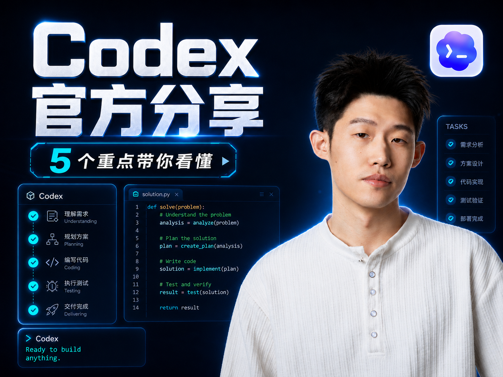
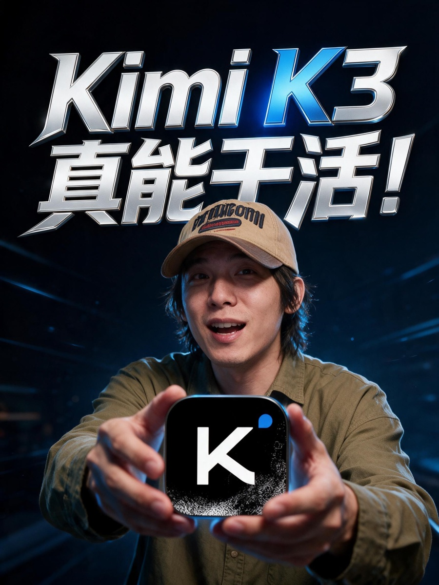
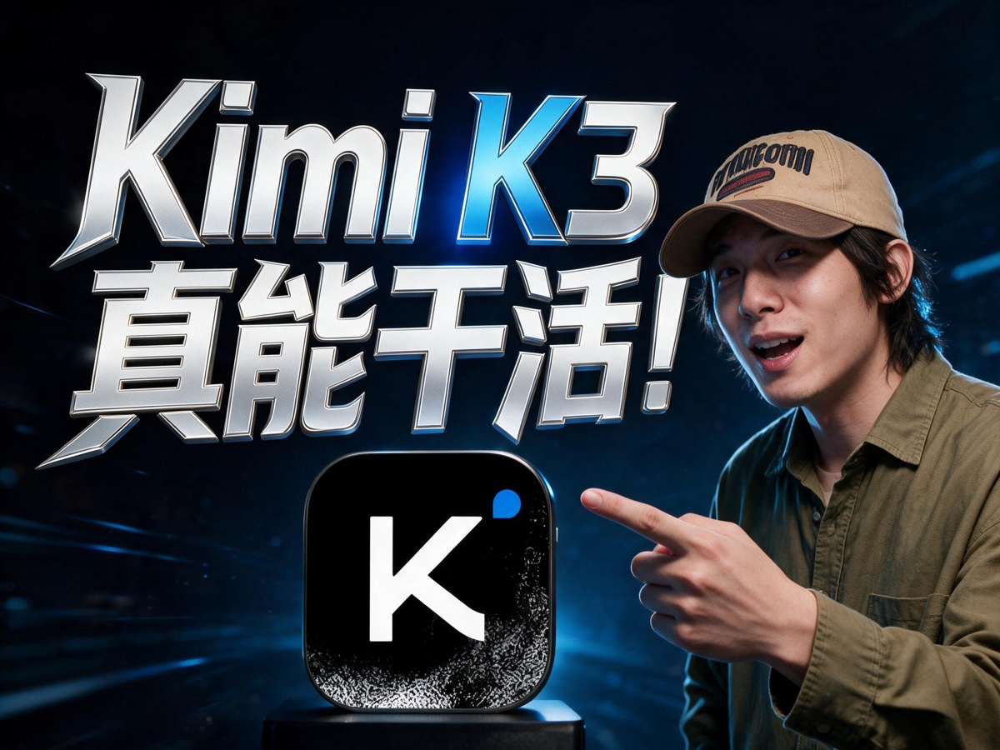
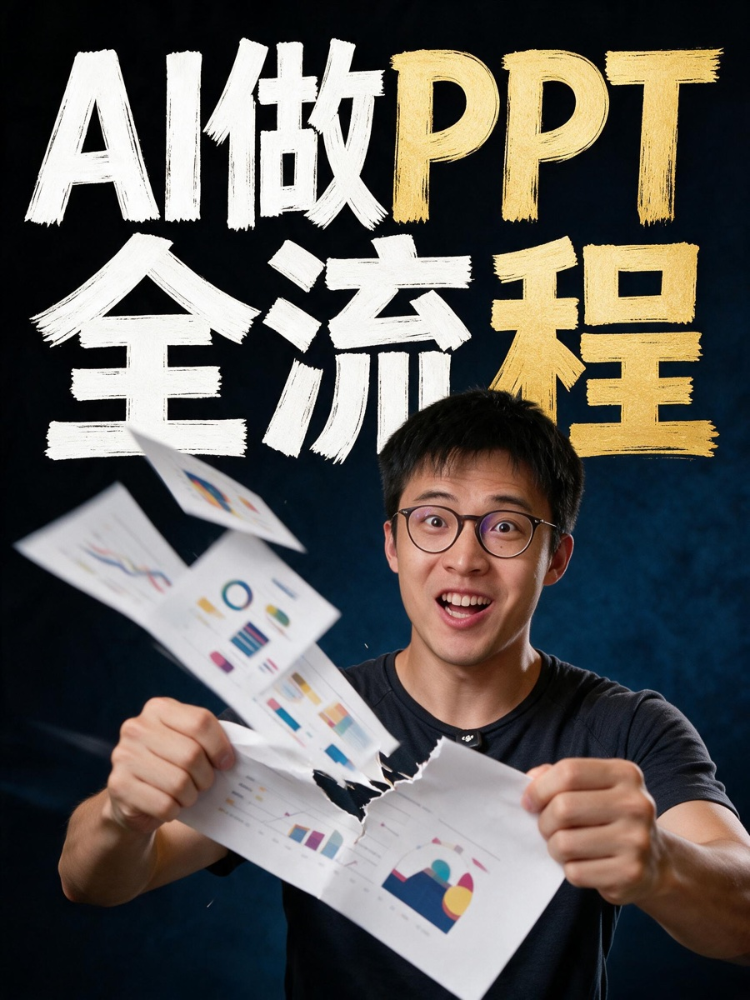
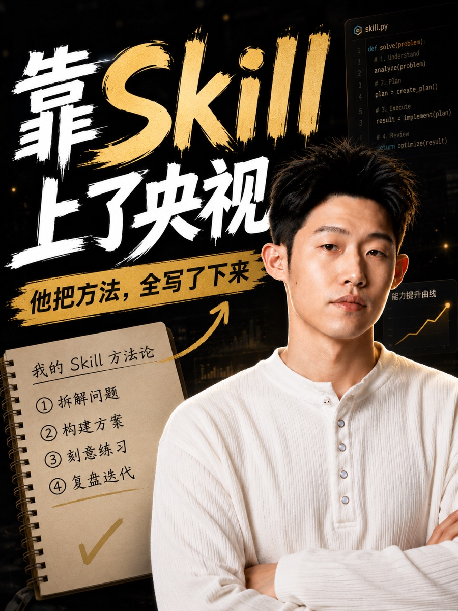
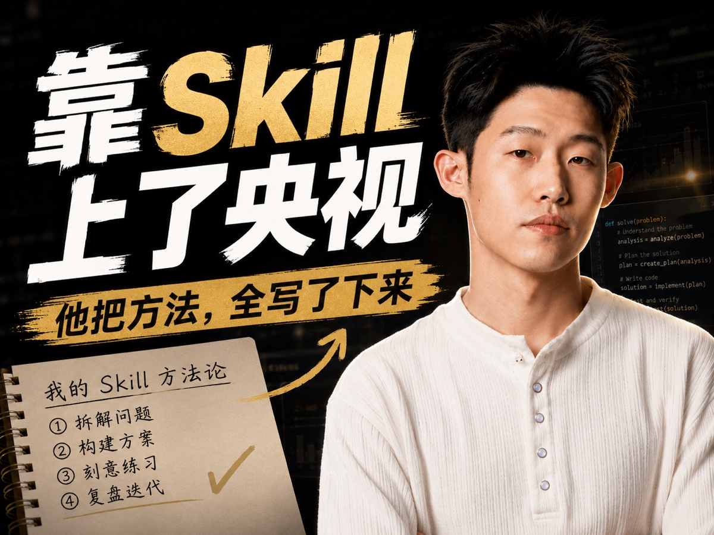
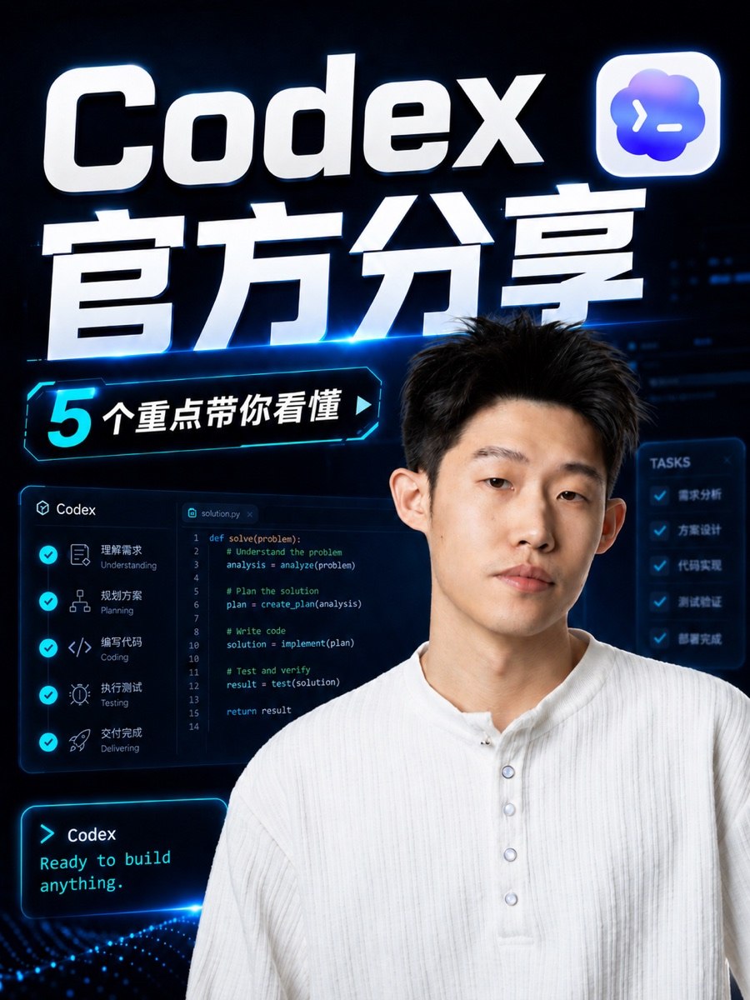
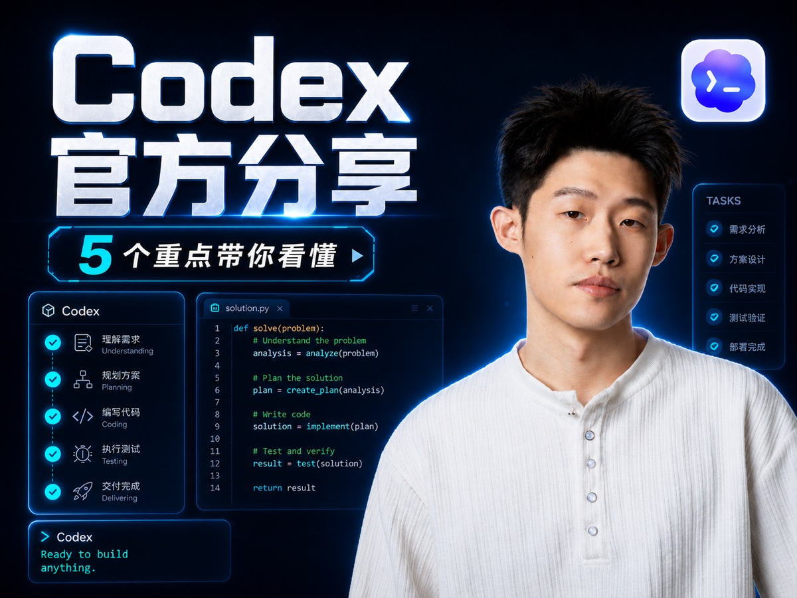

# 封面作品集

[真实发布成绩与后台截图](RESULTS.md) · [跨题材效果对照](COMPARISON.md)

## Codex 官方分享：与首页对应的双尺寸作品

| 3:4 竖版 | 4:3 横版 |
|:---:|:---:|
|  |  |

## 更多双模型创作案例

以下作品用于展示视觉设计和双尺寸能力，未将首页发布成绩归属于这些不同版本。

以下均由本 Skill 的真实工作流生成，并从候选中人工选出最终版。每组 4:3 都是选中 3:4 后的原生横版续作，不是简单裁切。

### Dreamina / Seedream：真人与产品互动

| 3:4 竖版 | 4:3 横版 |
|:---:|:---:|
|  |  |

短判断大字、真人态度、准确品牌物和明确互动动作共同完成点击钩子。横版重新设计标题占比与人物关系，同时延续服装、主色和品牌物。

### Dreamina / Seedream：结果动作化

| 3:4 竖版 | 4:3 横版 |
|:---:|:---:|
|  |  |

不堆 UI 和能力列表，而是把“AI 做 PPT”转成一个可记住的撕纸动作。标题、人物和结果证明在缩略图里仍然成立。

### GPT Image 2：黑金知识海报

| 3:4 竖版 | 4:3 横版 |
|:---:|:---:|
|  |  |

主标题负责主题和冲击，副标题负责收益，笔记本只保留一层方法证据。横版重排后仍是同一 campaign，而不是竖图向两边扩画布。

### GPT Image 2：品牌化科技封面

| 3:4 竖版 | 4:3 横版 |
|:---:|:---:|
|  |  |

同一位创作者、同一套主题，在不同尺寸里保持身份、品牌色和字体材质，同时按横竖场景分别优化信息层级。

[返回项目首页](../README.md)
